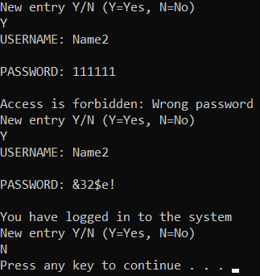

# Simple-Log-In-System
This is a c project. 

There is a file with some usernames and their passwords. 

After running the programm, a Hash List will be created and the recordings of the file will get inserted in the List.

Each user will have:

1) A Hash Key which will be a string with 8 characters 

2) A password which will be a string with 6 characters 

Finally the user will try to log in by giving their username and password.

If the pw and uname are correct, then a message saying "You have logged in to the system" will appear!

If the username is wrong, then the message will be "Access is forbidden: Wrong user ID"

And if the password is wrong, the message will be "Access is forbidden: Wrong password".

E.g.:

